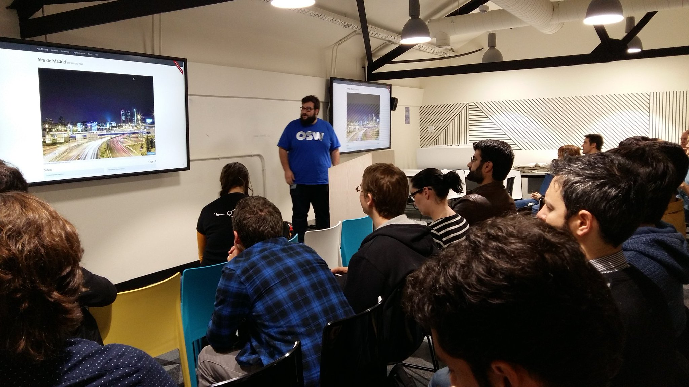
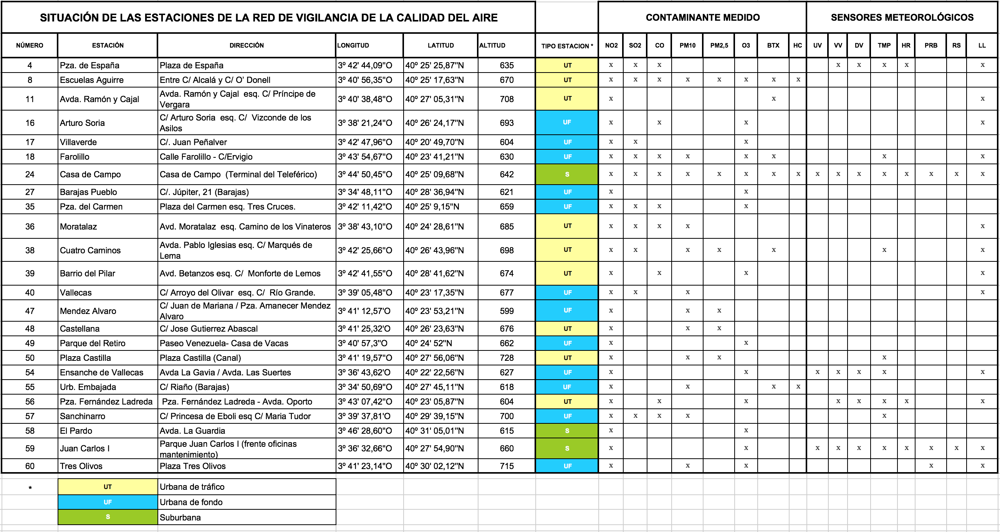
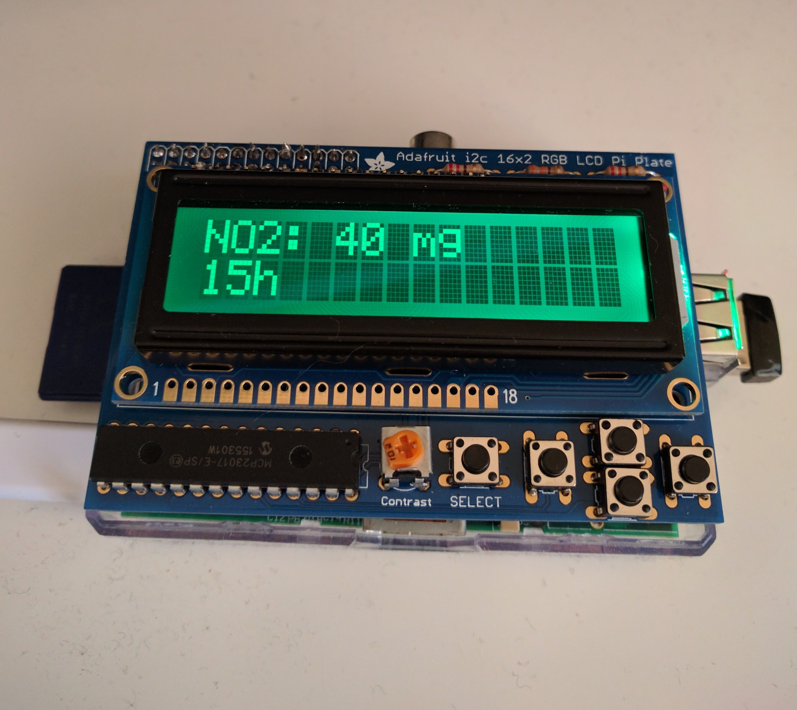

<h2 align="center">:warning: This repository is not longer maintained :warning:</h2>

# AireMadrid, la realidad de los datos abiertos

*[Source: foto de Twitter @betabeersMAD](https://twitter.com/betabeersMAD/status/842443319275868160)*

> Aire Madrid es una aplicación para poder ver los datos de la calidad del Aire de Madrid en tiempo real. Ulises nos hablará de las dificultades que supone crear un proyecto Open Source que utiliza los datos abiertos de calidad del aire que publica el Ayuntamiento de Madrid para informar y permitir la reutilización efectiva de esa información por parte de los usuarios y otros desarrolladores..
> - [Betabeers Madrid - 73: especial OpenData](https://betabeers.com/event/betabeers-madrid-73-especial-opendata-5201/)

### [BIO](bio.md)

### Aire de Madrid: Proyecto

**La web**
- [portal](http://airemadrid.herokuapp.com)
- [Historico](http://airemadrid.herokuapp.com/historico)
- [Sobre](http://airemadrid.herokuapp.com/sobre)
- [Agradecimientos](http://airemadrid.herokuapp.com/agradecimientos)

**Código**
- [Github](https://github.com/UlisesGascon/Aire-Madrid)

**En los portales de datos abiertos**
- [Aire Madrid en el catálogo de aplicaciones de datos.gob.es](http://datos.gob.es/es/node/473)
- [Aire Madrid en el catálogo de aplicaciones de datos.madrid.es](http://datos.madrid.es/portal/site/egob/menuitem.400a817358ce98c34e937436a8a409a0/?page=0&vgnextoid=994612b9ace9f310VgnVCM100000171f5a0aRCRD&vgnextchannel=994612b9ace9f310VgnVCM100000171f5a0aRCRD&vgnextfmt=default)

### Aire de Madrid: Hablemos de tecnología

**[V1 (2015)](https://github.com/UlisesGascon/Aire-Madrid/releases/tag/1.0.0)**

- Firebase (éstaticos)
- [Backend Node.js + Pillarsjs(RaspberryPi)](assets/server.png)

**[V2 (finales de 2015)](https://github.com/UlisesGascon/Aire-Madrid/releases/tag/2.0.0)**

- Migración a Heroku
- [API](https://github.com/UlisesGascon/Aire-Madrid#api)
- Pug/Jade

### Aire de Madrid: Problemas

**Concepto relativos**

- "[Tiempo real](http://datos.madrid.es/sites/v/index.jsp?vgnextoid=b8c427a272e4e410VgnVCM2000000c205a0aRCRD&vgnextchannel=374512b9ace9f310VgnVCM100000171f5a0aRCRD)"
- "Formatos"

**Obtención de la información**

- Fuente de datos:
    - [Web oficial](http://datos.madrid.es/portal/site/egob/menuitem.c05c1f754a33a9fbe4b2e4b284f1a5a0/?vgnextoid=41e01e007c9db410VgnVCM2000000c205a0aRCRD&vgnextchannel=374512b9ace9f310VgnVCM100000171f5a0aRCRD)
    - [Datos del momento](http://www.mambiente.munimadrid.es/opendata/horario.txt)
    - [Interpretación](http://datos.madrid.es/FWProjects/egob/contenidos/datasets/ficheros/Interprete_ficheros_%20calidad_%20del_%20aire_global.pdf)

**Datos Historicos**

- [Errores de formato en los ficheros](http://airemadrid.herokuapp.com/historico):

**Programación defensiva**

- [Source](http://datos.madrid.es/sites/v/index.jsp?vgnextoid=9e42c176313eb410VgnVCM1000000b205a0aRCRD&vgnextchannel=374512b9ace9f310VgnVCM100000171f5a0aRCRD)

- La estación fantasma (28 079 099)
    - [Media de red (28079099) desaparece de los datos](http://datos.madrid.es/portal/site/egob/menuitem.c05c1f754a33a9fbe4b2e4b284f1a5a0/?vgnextoid=41e01e007c9db410VgnVCM2000000c205a0aRCRD&vgnextchannel=374512b9ace9f310VgnVCM100000171f5a0aRCRD&vgnextfmt=default#1014)
    - [Versión anterior del documento](http://datos.madrid.es/FWProjects/egob/contenidos/datasets/ficheros/MedioAmbiente_CalidadAire/Interpretacion_datos_horarios_diarios.pdf)
        - Fecha de creación/modificación: 7/28/2015 2:02:13   
        - Creador: Antonio
    - [Versión posterior del documento](http://datos.madrid.es/FWProjects/egob/contenidos/datasets/ficheros/Interprete_ficheros_%20calidad_%20del_%20aire_global.pdf)
        - Fecha de creación/modificación: 1/24/2017 12:18:27 PM
        - Creador: Benito

- No comunicación
    - Las modificaciones de los datos no se reflejan en la web.
    - Los desarrolladores no somos avisados de ningun cambio.
    - No hay un lugar donde puedan consultarse los cambios realizados en la plataforma

- Datos que no llegan
    - Desde hace unos días los datos meteorologícos de las estaciones no llegan.
    - Las estaciones no envian los mismos parámetros.

### Aire de Madrid: Comunidad

**"[lcd air mad](https://github.com/superzen/lcd-air-mad/)" desarrollado por [Superzen](https://github.com/superzen)**

- [Historia del proyecto](https://github.com/superzen/lcd-air-mad/issues/1)

Monitor LCD/RGB con información de la calidad de aire (actualmente NO2) de una estación de Madrid

Monitor LCD/RGB con información de la calidad de aire (actualmente NO2) 
de una estación determinada de Madrid.

El lcd se colorea para indicar el estado del aire y así de 
un rápido vistazo sabemos como está la contaminación
antes de salir a correr, al parque con niños, etc... :)

Color | Calidad del aire
------|------------------
Verde | Buena 
Amarillo | Admisible 
Rojo | Deficiente 
Violeta | Mala

### Aire de Madrid: Futuro

- Nuevo concepto
- Nuevo diseño pensando en el usuario
- Nueva API
- Interpretación amigable de los datos
- Nueva Arquitectura:
    - [Pillarjs](http://pillarsjs.com/)
    - [GoblinDB](http://goblindb.osweekends.com/)
    - [Scheduled](https://www.npmjs.com/package/scheduled)
    - [Cheerio](https://cheerio.js.org/)
    - [Vue.js](https://vuejs.org/)
    - HTML5 y CSS3
- Nuevos datos y su ritmo de actualización:
    - weather (cada 3h)
    - stations (no definido)
    - acustic (cada día)
    - pollution (cada hora)
    - flu (cada semana)
    - pollen (cada día laborable)
